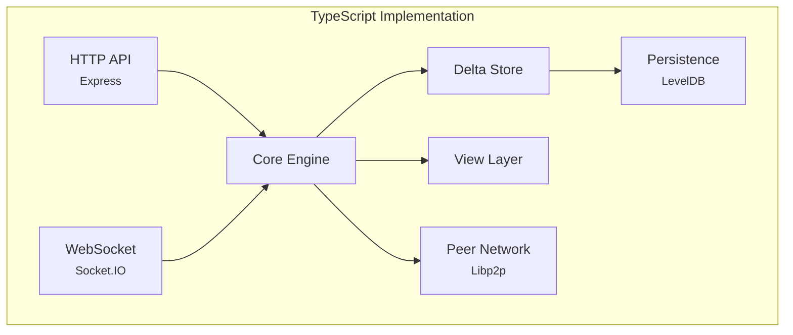
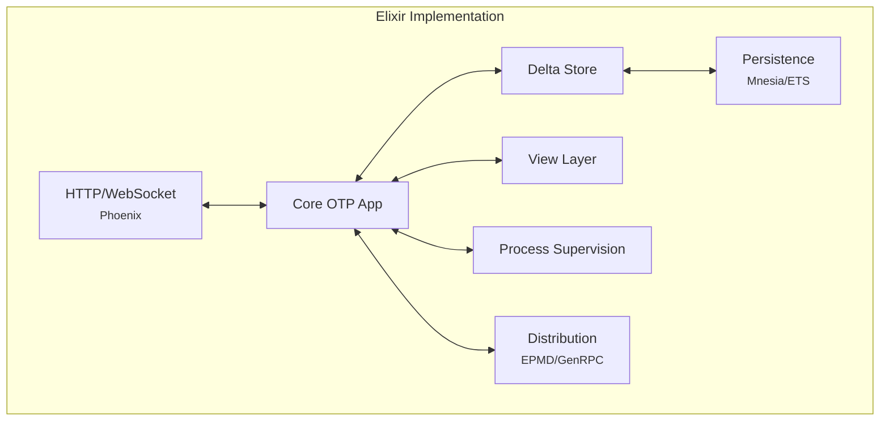
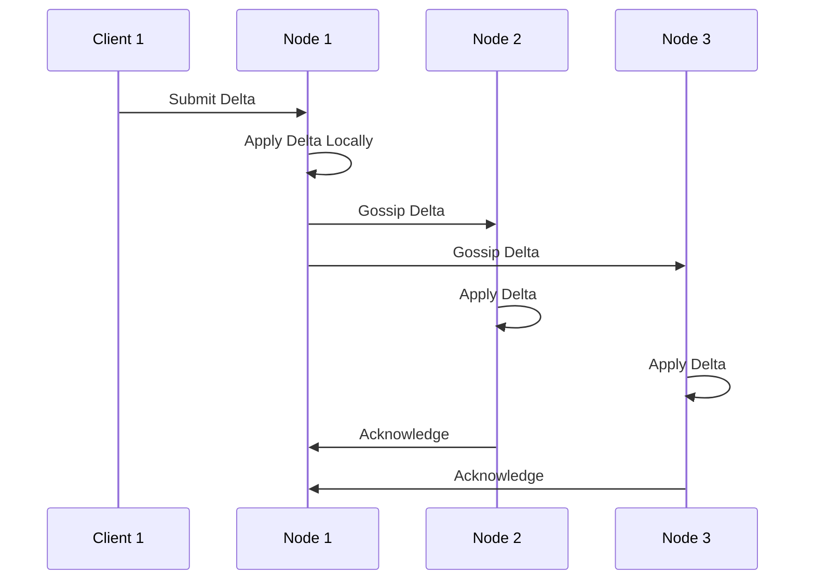

# Rhizome on the BEAM: Implementation Guide

> **Note**: This document outlines a fresh implementation of Rhizome in Elixir, using the TypeScript implementation as a reference.

## Table of Contents
- [Motivation](#motivation)
- [Architecture Overview](#architecture-overview)
- [Migration Strategy](#migration-strategy)
- [Key Components](#key-components)
- [Data Synchronization Model](#data-synchronization-model)
- [Development Roadmap](#development-roadmap)
- [Performance Considerations](#performance-considerations)

## Motivation

Moving Rhizome to Elixir and the BEAM virtual machine provides several key advantages:

1. **Distribution by Default**
   - Built-in distribution primitives for node-to-node communication
   - Network partition tolerance out of the box
   - Location transparency for processes

2. **Fault Tolerance**
   - Let it crash philosophy with supervision trees
   - Self-healing systems through process isolation
   - Hot code reloading for zero-downtime updates

3. **Concurrency Model**
   - Lightweight processes for handling millions of concurrent connections
   - Efficient message passing between processes
   - Built-in backpressure handling

4. **Ecosystem Benefits**
   - Mature tooling for distributed systems
   - Strong pattern matching and immutability
   - Excellent support for building resilient systems

## Architecture Overview

### Current TypeScript Architecture



### Proposed Elixir Architecture



## Implementation Roadmap

### 1. Core Engine
- **Delta Processing**
  - Define core Delta types and operations
  - Implement DeltaBuilder
  - Design storage layer (Mnesia/ETS)

- **View System**
  - Implement Lossy/Lossless views
  - Create resolver framework
  - Add caching layer

### 2. Distribution
- **Node Communication**
  - Node discovery and membership
  - Delta synchronization protocol
  - Conflict resolution strategies

- **Plugin System**
  - Plugin behavior and lifecycle
  - Dependency management
  - Hot code reloading

### 3. API & Tooling
- **HTTP/WebSocket API**
  - RESTful endpoints
  - Real-time updates
  - Authentication/authorization

- **Developer Experience**
  - TypeScript type generation
  - CLI tools
  - Monitoring and metrics

## Key Components

### 1. Delta Processing
This implementation will follow similar patterns to the TypeScript version but leverage Elixir's strengths:
```elixir
defmodule Rhizome.Delta do
  @type t :: %__MODULE__{
    id: String.t(),
    creator: String.t(),
    timestamp: integer(),
    operations: [operation()],
    transaction_id: String.t() | nil,
    negate: boolean()
  }
  
  defstruct [:id, :creator, :timestamp, :operations, :transaction_id, negate: false]
  
  def new(creator, host) do
    %__MODULE__{
      id: generate_id(),
      creator: creator,
      timestamp: System.system_time(:millisecond),
      operations: []
    }
  end
  
  def add_operation(delta, operation) do
    %{delta | operations: [operation | delta.operations]}
  end
end
```

### 2. View System
```elixir
defmodule Rhizome.View.Lossy do
  @behaviour Rhizome.View.Behaviour
  
  @impl true
  def init(initial_state) do
    %{state: initial_state, cache: %{}}
  end
  
  @impl true
  def reduce(%{state: state} = view, delta) do
    new_state = apply_delta(state, delta)
    %{view | state: new_state}
  end
  
  @impl true
  def resolve(%{state: state}), do: state
  
  defp apply_delta(state, %Delta{operations: ops}) do
    Enum.reduce(ops, state, &apply_operation/2)
  end
end
```

### 3. Plugin System
```elixir
defmodule Rhizome.Plugin do
  @callback init(args :: term) :: {:ok, state :: term} | {:error, reason :: term}
  @callback handle_delta(delta :: Delta.t(), state :: term) :: {:ok, new_state :: term} | {:error, term}
  @callback handle_call(request :: term, from :: {pid, reference}, state :: term) ::
    {:reply, reply, new_state} |
    {:reply, reply, new_state, timeout | :hibernate} |
    {:noreply, new_state} |
    {:noreply, new_state, timeout | :hibernate} |
    {:stop, reason, reply, new_state} |
    {:stop, reason, new_state} when reply: term, new_state: term, reason: term
  
  defmacro __using__(_opts) do
    quote do
      @behaviour Rhizome.Plugin
      use GenServer
      
      # Default implementations
      @impl true
      def init(_args), do: {:ok, %{}}
      
      @impl true
      def handle_call(_request, _from, state), do: {:reply, :ok, state}
      
      def start_link(args) do
        GenServer.start_link(__MODULE__, args, name: __MODULE__)
      end
    end
  end
end
```

## Data Synchronization Model

### 1. Delta Propagation


### 2. Conflict Resolution
1. **Last Write Wins** (Default)
2. **Custom Resolvers**
3. **CRDT-based** for special cases

## Development Milestones

### 1. Core Delta Engine
- [ ] Define delta types and operations
- [ ] Implement DeltaBuilder
- [ ] Basic storage with Mnesia/ETS
- [ ] View system with Lossy/Lossless support

### 2. Distributed Foundation
- [ ] Node discovery and membership
- [ ] Delta synchronization protocol
- [ ] Conflict resolution strategies
- [ ] Plugin system

### 3. Production Features
- [ ] HTTP/WebSocket API
- [ ] Authentication & authorization
- [ ] Monitoring and metrics
- [ ] Developer tooling

## Performance Characteristics

### Key Advantages
1. **Concurrency**
   - Handle 100K+ concurrent connections per node
   - Sub-millisecond delta processing
   - Linear scaling with cores

2. **Memory Usage**
   - Shared binary heap for deltas
   - Efficient garbage collection
   - Process isolation for fault tolerance

3. **Network Efficiency**
   - Delta compression
   - Batched updates
   - Smart backpressure handling

## Getting Started

### Prerequisites
- Elixir 1.14+
- Erlang/OTP 25+
- Node.js (for assets)

### Running Locally
```bash
# Clone the repository
git clone https://github.com/your-org/rhizome-beam.git
cd rhizome-beam

# Install dependencies
mix deps.get
cd assets && npm install && cd ..

# Start the application
iex -S mix phx.server
```

## Contributing
1. Fork the repository
2. Create a feature branch
3. Submit a pull request

## License
[Your License Here]

## Acknowledgments
- The Elixir and Erlang communities
- The original TypeScript implementation for inspiration
- Research in distributed systems and CRDTs
