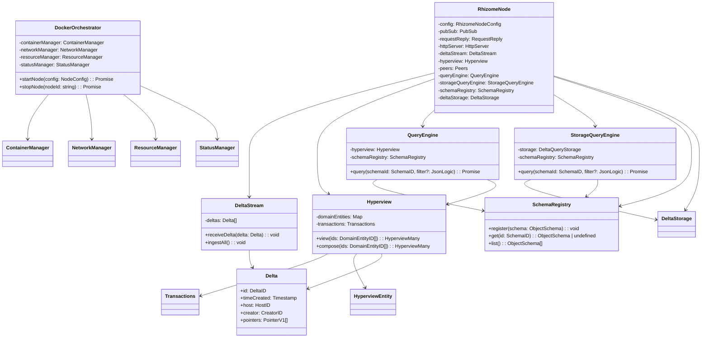

# Rhizome Node Class Diagram

This document provides an overview of the main classes in the Rhizome Node system and their relationships.

## Key Components

1. **RhizomeNode**: The main entry point that coordinates all other components
   - Manages the node's lifecycle and configuration
   - Coordinates between different subsystems

2. **Delta**: The fundamental data unit
   - Represents atomic changes in the system
   - Contains pointers to entities and their properties

3. **Hyperview**: Manages the hyperview of data
   - Maintains the complete history of deltas
   - Provides methods to view and compose entity states

4. **QueryEngine**: Handles data queries
   - Supports filtering with JSON Logic
   - Works with the schema system for validation

5. **StorageQueryEngine**: Handles storage-level queries
   - Interfaces with the underlying storage backend
   - Optimized for querying persisted data

6. **SchemaRegistry**: Manages data schemas
   - Validates data against schemas
   - Supports schema versioning and evolution

7. **DockerOrchestrator**: Manages containerized nodes
   - Handles node lifecycle (start/stop)
   - Manages networking between nodes

## Data Flow

1. Deltas are received through the DeltaStream
2. Hyperview processes and stores these deltas
3. Queries can be made through either QueryEngine (in-memory) or StorageQueryEngine (persisted)
4. The system maintains consistency through the schema system
5. In distributed mode, DockerOrchestrator manages multiple node instances
